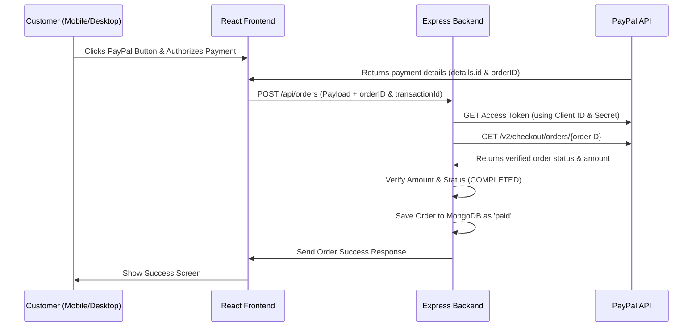

# PayPal Backend Integration & Order Verification Guide

This guide details the security best practices and provides production-ready code to verify PayPal transactions on your Node.js/Express backend before saving orders to MongoDB.

---

## 1. How the Secure Payment Flow Works
To prevent fraud (e.g., users spoofing transactions or modifying payment amounts in the frontend), your backend must verify the transaction details directly with PayPal's API:



---

## 2. Backend Environment Variables
Add your PayPal credentials to your backend `.env` file:

```env
# PayPal Configuration
PAYPAL_CLIENT_ID=your_paypal_client_id
PAYPAL_CLIENT_SECRET=your_paypal_client_secret
PAYPAL_MODE=sandbox # Change to 'live' for production
PORT=5000
MONGODB_URI=your_mongodb_connection_string
```

---

## 3. Order Model (MongoDB Schema)
Update your order schema in MongoDB to keep track of the PayPal details and payment status:

```javascript
// models/Order.js
const mongoose = require('mongoose');

const OrderSchema = new mongoose.Schema({
  // Customer details
  businessName: { type: String, required: true },
  email: { type: String, required: true },
  phone: { type: String, required: true },
  
  // Service info
  serviceType: { type: String, enum: ['new', 'recovery', 'regular'], required: true },
  originalPrice: { type: Number, required: true },
  discountAmount: { type: Number, default: 0 },
  finalAmount: { type: Number, required: true }, // Price in SAR
  
  // Payment info
  paymentMethod: { type: String, enum: ['paypal', 'manual'], required: true },
  paymentStatus: { 
    type: String, 
    enum: ['pending_verification', 'paid', 'failed'], 
    default: 'pending_verification' 
  },
  
  // PayPal transaction details
  paypalOrderId: { type: String, unique: true, sparse: true },
  paypalTransactionId: { type: String, unique: true, sparse: true },
  payerName: { type: String },
  payerEmail: { type: String },
  
  // Metadata
  orderStatus: { 
    type: String, 
    enum: ['pending_review', 'in_progress', 'completed', 'cancelled'], 
    default: 'pending_review' 
  },
  createdAt: { type: Date, default: Date.now }
}, { strict: false });

module.exports = mongoose.model('Order', OrderSchema);
```

---

## 4. Secure PayPal Verification Middleware
Use the following helper functions to query the official PayPal API to get an access token and retrieve order details:

```javascript
// utils/paypal.js
const axios = require('axios');

const getPayPalBaseUrl = () => {
  return process.env.PAYPAL_MODE === 'live'
    ? 'https://api-m.paypal.com'
    : 'https://api-m.sandbox.paypal.com';
};

/**
 * Get Access Token from PayPal OAuth2 API
 */
const getPayPalAccessToken = async () => {
  const auth = Buffer.from(
    `${process.env.PAYPAL_CLIENT_ID}:${process.env.PAYPAL_CLIENT_SECRET}`
  ).toString('base64');

  try {
    const response = await axios({
      url: `${getPayPalBaseUrl()}/v1/oauth2/token`,
      method: 'post',
      headers: {
        Accept: 'application/json',
        'Accept-Language': 'en_US',
        Authorization: `Basic ${auth}`,
        'Content-Type': 'application/x-www-form-urlencoded',
      },
      data: 'grant_type=client_credentials',
    });
    return response.data.access_token;
  } catch (error) {
    console.error('PayPal OAuth token generation failed:', error.response?.data || error.message);
    throw new Error('PayPal Authentication failed');
  }
};

/**
 * Get Order Details from PayPal by Order ID
 */
const getPayPalOrderDetails = async (orderId) => {
  const accessToken = await getPayPalAccessToken();

  try {
    const response = await axios({
      url: `${getPayPalBaseUrl()}/v2/checkout/orders/${orderId}`,
      method: 'get',
      headers: {
        Authorization: `Bearer ${accessToken}`,
        'Content-Type': 'application/json',
      },
    });
    return response.data;
  } catch (error) {
    console.error('Failed to fetch PayPal order details:', error.response?.data || error.message);
    throw new Error('PayPal order verification failed');
  }
};

module.exports = {
  getPayPalOrderDetails
};
```

---

## 5. Express Route/Controller (Secure Order Placement)
Inside your order submission endpoint, verify the transaction amount and state:

```javascript
// routes/orderRoutes.js
const express = require('express');
const router = express.Router();
const Order = require('../models/Order');
const { getPayPalOrderDetails } = require('../utils/paypal');

router.post('/create', async (req, res) => {
  try {
    const orderData = req.body;

    // 1. Check if the order is already submitted or handled
    if (orderData.paymentMethod === 'paypal') {
      if (!orderData.paypalOrderId) {
        return res.status(400).json({ success: false, message: 'PayPal Order ID is required' });
      }

      // Check for duplicate order execution
      const existingOrder = await Order.findOne({ paypalOrderId: orderData.paypalOrderId });
      if (existingOrder) {
        return res.status(400).json({ success: false, message: 'This transaction has already been processed.' });
      }

      // 2. Fetch official transaction details directly from PayPal
      const paypalOrder = await getPayPalOrderDetails(orderData.paypalOrderId);

      // Verify the order is indeed COMPLETED/APPROVED
      if (paypalOrder.status !== 'COMPLETED' && paypalOrder.status !== 'APPROVED') {
        return res.status(400).json({ success: false, message: 'PayPal transaction is not completed.' });
      }

      // 3. Verify target price match to prevent client-side price tampering
      // Note: GMB form conversion converts SAR to USD using pegged rate 3.75
      const expectedUSDAmount = (orderData.finalAmount / 3.75).toFixed(2);
      
      const captureDetails = paypalOrder.purchase_units[0].payments.captures[0];
      const paidUSDAmount = parseFloat(captureDetails.amount.value).toFixed(2);

      if (parseFloat(paidUSDAmount) < parseFloat(expectedUSDAmount)) {
        return res.status(400).json({ 
          success: false, 
          message: 'Payment amount mismatch. Security verification failed.' 
        });
      }

      // Update payload details with official PayPal data
      orderData.paymentStatus = 'paid';
      orderData.paypalTransactionId = captureDetails.id;
      orderData.payerName = `${paypalOrder.payer.name.given_name} ${paypalOrder.payer.name.surname}`;
      orderData.payerEmail = paypalOrder.payer.email_address;
    } else {
      // Manual payment flow remains as pending verification
      orderData.paymentStatus = 'pending_verification';
    }

    // 4. Save verified order details to database
    const newOrder = new Order(orderData);
    await newOrder.save();

    res.status(201).json({
      success: true,
      message: 'Order placed and verified successfully',
      order: newOrder
    });

  } catch (error) {
    console.error('Order creation error:', error);
    res.status(500).json({ 
      success: false, 
      message: 'Server error while placing order.', 
      error: error.message 
    });
  }
});

module.exports = router;
```
